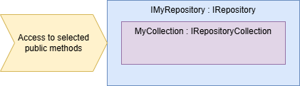

# Tharga MongoDB
[](https://www.nuget.org/packages/Tharga.MongoDB)

[](LICENSE)
[](https://github.com/Tharga/MongoDB/issues?q=is%3Aopen)

## Get started
Install the nuget package `Tharga.MongoDB`. It is available at [nuget.org](#https://www.nuget.org/packages/Tharga.MongoDB).

Add *MongoDB* usage to services.
```
builder.Services.AddMongoDB();
```

Add configuration to *appsettings.json*.
```
"ConnectionStrings": {
  "Default": "mongodb://localhost:27017/HostSample{Environment}{Part}"
},
```
Create your entity, repository and collection.
```
public record WeatherForecast : EntityBase
{
    public DateOnly Date { get; set; }
    public int TemperatureC { get; set; }
    public int TemperatureF => 32 + (int)(TemperatureC / 0.5556);
    public string? Summary { get; set; }
}

public interface IWeatherForecastRepository : IRepository
{
    IAsyncEnumerable<WeatherForecast> GetAsync();
    Task AddRangeAsync(WeatherForecast[] weatherForecasts);
}

internal class WeatherForecastRepository : IWeatherForecastRepository
{
    private readonly IWeatherForecastRepositoryCollection _collection;

    public WeatherForecastRepository(IWeatherForecastRepositoryCollection collection)
    {
        _collection = collection;
    }

    public IAsyncEnumerable<WeatherForecast> GetAsync()
    {
        return _collection.GetAsync();
    }

    public async Task AddRangeAsync(WeatherForecast[] weatherForecasts)
    {
        foreach (var weatherForecast in weatherForecasts)
        {
            await _collection.AddAsync(weatherForecast);
        }
    }
}

public interface IWeatherForecastRepositoryCollection : IDiskRepositoryCollection<WeatherForecast>
{
}

internal class WeatherForecastRepositoryCollection : DiskRepositoryCollectionBase<WeatherForecast>, IWeatherForecastRepositoryCollection
{
    public WeatherForecastRepositoryCollection(IMongoDbServiceFactory mongoDbServiceFactory, ILogger<RepositoryCollectionBase<WeatherForecast, ObjectId>> logger)
        : base(mongoDbServiceFactory, logger)
    {
    }
}
```

### Repositories and collections
The framework is based on *repositories* and *collections* and the *entity* to be saved.
- Repositories implements *IRepository*
- Collections implements *IRepositoryCollection*
- Entities implements *IEntity&lt;TKey&gt;*

The repositories and collections are registered in the IOC automatically.

The pattern is built up like this.
The *repository* holds the *collection* inside.
The *repository* exposes the functions, that you create, protecting any operation to be used directly.
The *collection* can be of different types that acts in different ways, it can also be dynamic for *multi tennant* systems.



### More about collections
There are three implemented types of collections, *IDiskRepositoryCollection* and *ILockableRepositoryCollection* that can be used in different types of scenarios.

#### IDiskRepositoryCollection
This is the main type of collection. It does what you expect, saving and loading data directly from the database.

#### ILockableRepositoryCollection
This is a write-protected collection that you can only update by requesting an exclusive lock.
It can be used similar to a queue.

### Simpler way of doing repositories
The simplest way is to have the *repository* implement the *collection* directly.
The downside is that you cannot protect access to methods, the cosumer will have access to it all.
```
public class MySimpleRepo : DiskRepositoryCollectionBase<MyEntity>
{
    public MySimpleRepo(IMongoDbServiceFactory mongoDbServiceFactory)
        : base(mongoDbServiceFactory)
    {
    }
}

public record MyEntity : EntityBase
{
}
```

## Simple Console Sample
This is a simple demo for a console application written in .NET 7.
The following nuget packages are used.
- Tharga.MongoDB
- Microsoft.Extensions.Hosting

```
using Microsoft.Extensions.DependencyInjection;
using MongoDB.Bson;
using Tharga.MongoDB;
using Tharga.MongoDB.Disk;

var services = new ServiceCollection();
services.AddMongoDB(o.ConnectionStringLoader = (_,_) => Task.FromResult<ConnectionString>("mongodb://localhost:27017/SimpleDemo"));

var serviceProvider = services.BuildServiceProvider();

var simpleRepo = serviceProvider.GetService<MySimpleRepo>();
await simpleRepo!.AddAsync(new MyEntity());
var oneItem = await simpleRepo.GetOneAsync(x => true);

Console.WriteLine($"Got item with id '{oneItem.Id}' from the database.");

public class MySimpleRepo : DiskRepositoryCollectionBase<MyEntity, ObjectId>
{
    public MySimpleRepo(IMongoDbServiceFactory mongoDbServiceFactory)
        : base(mongoDbServiceFactory)
    {
    }
}

public record MyEntity : EntityBase<ObjectId>
{
}
```

---

## More details

### Configuration
Configuring can be done in `appsettings.json` or by code. Code is always used first value by value.
If using multiple (named) databases, configuration will always use the named version first if there is one and then use the general fallback value.
This is the order used, value by value.
1. Named configuration from code
1. General configuration from code
1. Named configuration from IConfiguration
1. General configuration from IConfiguration
1. Default values

#### Example of configuration by `appsettings.json`.
When the 'Default' database is used, the result limit will be 100, for the 'Other' database the result limit will be 200.
If another database is implemented, the fallback of 1000 will be used as result limit.

The 'Default' database will have the firewall opened, if hosted in Atlas MongoDB.

```
  "ConnectionStrings": {
    "Default": "mongodb://localhost:27017/Tharga{environment}_Sample{part}",
    "Other": "mongodb://localhost:27017/Tharga{environment}_Sample_Other{part}"
  },
  "MongoDB": {
    "Default": {
      "AccessInfo": {
        "PublicKey": "[PublicKey]",
        "PrivateKey": "[PrivateKey]",
        "GroupId": "[GroupId]"
      },
      "ResultLimit": 100,
      "AutoClean": true,
      "CleanOnStartup": true,
      "CreateCollectionStrategy": "DropEmpty"
    },
    "Other": {
      "ResultLimit": 200
    },
    "ResultLimit": 1000
    "AutoClean": false,
    "CleanOnStartup": false,
    "CreateCollectionStrategy": "DropEmpty"
  }
```

#### Example of configuration by code.
This would be the same configuration as from the example above.
```
services.AddMongoDB(o =>
{
    o.ConnectionStringLoader = async (name, provider) =>
    {
        return (string)name switch
        {
            "Default" => "mongodb://localhost:27017/Tharga{environment}_Sample{part}",
            "Other" => "mongodb://localhost:27017/Tharga{environment}_Sample_Other{part}",
            _ => throw new ArgumentException($"Unknown configuration name '{name}'.")
        };
    };
    o.ConfigurationLoader = async () => new MongoDbConfigurationTree
    {
        Configurations = new Dictionary<ConfigurationName, MongoDbConfiguration>
        {
            {
                "Default", new MongoDbConfiguration
                {
                    AccessInfo = new MongoDbApiAccess
                    {
                        PublicKey = "[PublicKey]",
                        PrivateKey = "[PrivateKey]",
                        GroupId = "[GroupId]"
                    },
                    ResultLimit = 100,
                    AutoClean = true,
                    CleanOnStartup = true,
                    "CreateCollectionStrategy": "DropEmpty"
                }
            },
            {
                "Other", new MongoDbConfiguration
                {
                    ResultLimit = 200
                }
            }
        },
        ResultLimit = 1000,
        AutoClean = false,
        CleanOnStartup = false,
        "CreateCollectionStrategy": "DropEmpty"
    };
});
```

## ConnectionStringLoader
To dynamically use connectionstrings depending on *ConfigurationName* or other parameters it is possible to create a custom implementation of *ConnectionStringLoader*.
If it is not implemented, or returns null, then the configuration in *IConfiguration* will be used.

After the *ConnectionStringLoader* is called the [MongoUrl Builder](#mongourlbuilder) will run. This means you can provide any variables (Values between '\{' and '\}') that your *MongoUrl Builder* can handle

This is the simplest version to be implemented.
```
services.AddMongoDB(o.ConnectionStringLoader = (_,_) => Task.FromResult<ConnectionString>("mongodb://localhost:27017/MyDatabase{part}"));
```

You can also implement your own class for this.
```
public void ConfigureServices(IServiceCollection services)
{
    services.AddTransient<ConnectionStringLoader>();
    services.AddMongoDB(o =>
    {
        o.ConnectionStringLoader = async (name, provider) => await provider.GetService<ConnectionStringLoader>().GetConnectionString(name);
    });
}

public class ConnectionStringLoader
{
    private readonly ISomeDependency _someDependency;

    public ConnectionStringLoader(ISomeDependency someDependency)
    {
        _someDependency = someDependency;
    }

    public async Task<string> GetConnectionString(string configurationName)
    {
        switch (configurationName)
        {
            case "A":
                //Load value from other location
                return await _someDependency.GetValueAsync();
            case "B":
                //Build string dynamically
                return $"mongodb://localhost:27017/Tharga_{Environment.MachineName}{{part}}";
            case "C":
                //Use IConfiguration
                return null;
            default:
                throw new ArgumentOutOfRangeException($"Unknown configurationName '{configurationName}'.");
        }
    }
}
```


### Customize collections
Properties for classes deriving from `RepositoryCollectionBase<,>` can be customised directly by overriding the default behaviour of the code or configuration.

By default the name of the collection is the same as the type name of the entity.
To have a different name the property `CollectionName` can be overridden.

The name of the database can be built up dynamically, use `DatabasePart` to do so.
Read more about this in the section [MongoUrl Builder](#mongourlbuilder).

Override property `ConfigurationName` to use different database than default (or set as default in `DatabaseOptions`).
This makes it possible to use multiple databases from the same application.

The properties `AutoClean`, `CleanOnStartup`, `CreateCollectionStrategy` and `ResultLimit` can be overridden by collection to be different from the configuration.

To automatically register known types when using multiple types in the same collection, provide a value for `Types`.

Create `Indices` by overriding the property in your collection class.
The list of `Indices` is applied befor the first record is added to the collection.
It is also reviewed once every time the application starts, removing `Indices` that no longer exists and creates new ones if the code have changed.

### MongoUrl Builder
The `MongoUrl` is created by a built in implementation of `IMongoUrlBuilder`. It takes the raw version and parses variables to build `MongoUrl`.

Two variables are supported `{environment}` and `{part}`.

To dynamicaly change the name of the database `{part}` can be used. It can be used as an override to a collection or provided as a variable in `DatabaseContext` together with [CollectionProvider](#collectionprovider).

For `{environment}` the value will be ommitted when it is set to 'Production'.

Both variables will get a leading character of '_'.

Example for Development with the databasePart = MyPart.
`mongodb://localhost:27017/Tharga{environment}_Sample{part}` --> `mongodb://localhost:27017/Tharga_Development_Sample_MyPart`

#### Custom MongoUrl Builder
If there is a need for a custom string builder, implement the interface `IMongoUrlBuilder` and register with the IOC and that will be used instead of the built in version.
Register your own version of IMongoUrlBuilder in IOC.
```
services.AddTransient<IMongoUrlBuilder, MyMongoUrlBuilder>();
```

---

## Atlas MongoDB Firewall
When configuring the `AccessInfo` and the database is accessing a database other than localhost the firewall will be opened automatically for the current IP.
There are more details on the [mongodb.com](https://www.mongodb.com/docs/atlas/configure-api-access/#std-label-create-org-api-key) site.

### Public- and PrivateKey
To create a key-pair, select *Access Manager* for the *organization*. Then Select the tab *Applications* and *API Keys*. Here you can create keys with the correct access.

#### GroupId
The *GroupId* can be found as part of the URL on the *Atlas MongoDB* website.
Example. `https://cloud.mongodb.com/v2/[GroupId]`

## MongoDB Result Limit
It is possible to se t a hard limit for the number of documents returned. If the limit is reached `ResultLimitException` is thrown.
For large result-sets, use the method `GetPageAsync` to get the `ResultLimit` on each page of the result.

```
{
  "MongoDB": {
    "ResultLimit": 500
  }
}
```
