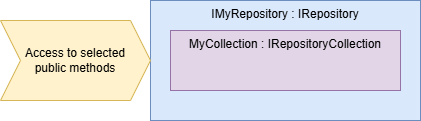

# Tharga MongoDB
[](https://www.nuget.org/packages/Tharga.MongoDB)

[](LICENSE)
[](https://github.com/Tharga/MongoDB/issues?q=is%3Aopen)

## Get started
Install the nuget package `Tharga.MongoDB`. It is available at [nuget.org](#https://www.nuget.org/packages/Tharga.MongoDB).

Add *MongoDB* usage to services.
```csharp
builder.AddMongoDB();
```

Or, if you only have access to `IServiceCollection`:
```csharp
builder.Services.AddMongoDB();
```

Add configuration to *appsettings.json*.
```
"ConnectionStrings": {
  "Default": "mongodb://localhost:27017/HostSample{Environment}{Part}"
},
```
Create your entity, repository and collection.
```
public record WeatherForecast : EntityBase
{
    public DateOnly Date { get; set; }
    public int TemperatureC { get; set; }
    public int TemperatureF => 32 + (int)(TemperatureC / 0.5556);
    public string? Summary { get; set; }
}

public interface IWeatherForecastRepository : IRepository
{
    IAsyncEnumerable<WeatherForecast> GetAsync();
    Task AddRangeAsync(WeatherForecast[] weatherForecasts);
}

internal class WeatherForecastRepository : IWeatherForecastRepository
{
    private readonly IWeatherForecastRepositoryCollection _collection;

    public WeatherForecastRepository(IWeatherForecastRepositoryCollection collection)
    {
        _collection = collection;
    }

    public IAsyncEnumerable<WeatherForecast> GetAsync()
    {
        return _collection.GetAsync();
    }

    public async Task AddRangeAsync(WeatherForecast[] weatherForecasts)
    {
        foreach (var weatherForecast in weatherForecasts)
        {
            await _collection.AddAsync(weatherForecast);
        }
    }
}

public interface IWeatherForecastRepositoryCollection : IDiskRepositoryCollection<WeatherForecast>
{
}

internal class WeatherForecastRepositoryCollection : DiskRepositoryCollectionBase<WeatherForecast>, IWeatherForecastRepositoryCollection
{
    public WeatherForecastRepositoryCollection(IMongoDbServiceFactory mongoDbServiceFactory, ILogger<RepositoryCollectionBase<WeatherForecast, ObjectId>> logger)
        : base(mongoDbServiceFactory, logger)
    {
    }
}
```

### Repositories and collections
The framework is based on *repositories* and *collections* and the *entity* to be saved.
- Repositories implements *IRepository*
- Collections implements *IRepositoryCollection*
- Entities implements *IEntity&lt;TKey&gt;*

The repositories and collections are registered in the IOC automatically.

#### Auto-registration scope
By default, `AddMongoDB()` scans assemblies whose name starts with the same prefix as your entry-point assembly (via `AssemblyService.GetAssemblies()`).
This means repositories and collections defined in **external NuGet packages** (e.g. `Tharga.Team.Service`) are **not** discovered automatically.

To include an external assembly, call `AddAutoRegistrationAssembly()`:
```csharp
builder.Services.AddMongoDB(o =>
{
    o.AddAutoRegistrationAssembly(typeof(SomeTypeFromPackage).Assembly);
});
```

You can also replace the default scan entirely:
```csharp
builder.Services.AddMongoDB(o =>
{
    o.AutoRegistrationAssemblies = AssemblyService.GetAssemblies<Program>();
    o.AddAutoRegistrationAssembly(typeof(SomeTypeFromPackage).Assembly);
});
```

**For NuGet package authors:** if your package ships MongoDB collections, either document that consumers must call `AddAutoRegistrationAssembly()`, or handle it inside your own registration method (see `Tharga.Cache.MongoDB` for an example):
```csharp
public static void AddMyFeature(this DatabaseOptions options)
{
    options.AddAutoRegistrationAssembly(Assembly.GetAssembly(typeof(MyMarkerType)));
}
```

#### Collections that take `DatabaseContext`
Auto-registration treats `DatabaseContext` as a runtime parameter. The behavior depends on which constructors a collection exposes:

| Constructor shape | Auto-registered in DI? | How to resolve |
|---|---|---|
| At least one constructor **without** `DatabaseContext` | ✅ Yes | Inject the interface directly, or resolve via `ICollectionProvider` |
| **All** constructors require `DatabaseContext` | ❌ No (by design) | Resolve via `ICollectionProvider.GetCollection<T>(databaseContext)` |

A collection that should support both patterns — direct injection (default context) and per-tenant resolution — must make the `DatabaseContext` parameter optional:
```csharp
public class WeatherRepositoryCollection : DiskRepositoryCollectionBase<WeatherEntity>, IWeatherRepositoryCollection
{
    public WeatherRepositoryCollection(IMongoDbServiceFactory factory, ILogger<WeatherRepositoryCollection> logger,
        DatabaseContext databaseContext = null)        // <-- optional
        : base(factory, logger, databaseContext)
    {
    }
}
```

**Multi-tenant collections** that should always be resolved per-context (i.e. only have constructors that require `DatabaseContext`) are deliberately skipped during auto-registration. Use `ICollectionProvider`:
```csharp
public class WeatherService(ICollectionProvider provider)
{
    public async Task<int> CountAsync(string tenantId)
    {
        var collection = provider.GetCollection<IWeatherRepositoryCollection>(
            new DatabaseContext { DatabasePart = tenantId });
        return (int)await collection.CountAsync();
    }
}
```

**Do not register these collections manually with `AddTransient`** — `DatabaseContext` is not in DI, so resolution fails at startup.

The pattern is built up like this.
The *repository* holds the *collection* inside.
The *repository* exposes the functions, that you create, protecting any operation to be used directly.
The *collection* can be of different types that acts in different ways, it can also be dynamic for *multi tennant* systems.



### More about collections
There are three implemented types of collections, *IDiskRepositoryCollection* and *ILockableRepositoryCollection* that can be used in different types of scenarios.

#### IDiskRepositoryCollection
This is the main type of collection. It does what you expect, saving and loading data directly from the database.

#### ILockableRepositoryCollection
This is a write-protected collection that you can only update by requesting an exclusive lock.
It can be used similar to a queue.

##### Pick-style lock (decision known up front)
When you already know whether you'll update or delete the document at lock time:

```csharp
await using var scope = await collection.PickForUpdateAsync(id);
scope.Entity.Data = "updated";
await scope.CommitAsync();        // writes the change and clears the lock

await using var del = await collection.PickForDeleteAsync(id);
await del.CommitAsync();          // deletes the document
```

Both methods accept `id`, `FilterDefinition<TEntity>`, or `Expression<Func<TEntity, bool>>` predicate, plus an optional `timeout`, `actor`, and `completeAction` callback. Disposal without `CommitAsync` releases the lock unchanged.

##### Unified lock (decision at commit time)
When you need to inspect the document before deciding update vs delete, use `LockAsync` and pass a `CommitMode` to `CommitAsync`:

```csharp
await using var scope = await collection.LockAsync(id);
if (ShouldDelete(scope.Entity))
{
    await scope.CommitAsync(CommitMode.Delete);
}
else
{
    var updated = scope.Entity with { Data = "updated" };
    await scope.CommitAsync(CommitMode.Update, updated);
}
```

`AbandonAsync` releases without changes; `SetErrorStateAsync(ex)` records an exception on the lock; disposal without commit calls `AbandonAsync`. Same semantics as `PickFor*` — both go through the same internal acquire-lock primitive.

##### Multi-document lease
To inspect several documents and decide each one's fate before committing them all, use `LockManyAsync`. Acquisition is sequential, ordered by key (so two leases targeting overlapping sets always lock in the same order — no AB / BA deadlocks). If any acquisition fails, partial locks are rolled back.

```csharp
await using var lease = await collection.LockManyAsync(new[] { id1, id2, id3 });

foreach (var doc in lease.Documents)
{
    if (ShouldDelete(doc))
        lease.MarkForDelete(doc.Id);
    else if (HasChanges(doc))
        lease.MarkForUpdate(doc with { Data = "..." });
    // else: leave unmarked — released unchanged at commit
}

var summary = await lease.CommitAsync();
// summary.Updated / Deleted / ReleasedUnchanged / Failures
```

Multi-doc commit is **sequential** by default: each decision is applied in mark order, and per-decision failures are collected into `summary.Failures` rather than thrown. For all-or-nothing semantics — atomic apply of every staged decision in one transaction — pass `transactional: true`:

```csharp
var summary = await lease.CommitAsync(transactional: true);
// All decisions land or none do. A single failed decision aborts the transaction.
```

`LockManyAsync` also accepts a `FilterDefinition<TEntity>` or an `Expression<Func<TEntity, bool>>` predicate — both resolve to an id list at acquire time. Transactional commit requires a replica set / sharded MongoDB cluster (see Transactions below).

##### Structured error handling with `ExecuteAsync`

The `EntityScope.ExecuteAsync` extension wraps the common pick → mutate → commit flow into a single call:

```csharp
await using var scope = await collection.PickForUpdateAsync(id);
await scope.ExecuteAsync(async job =>
{
    job.Data = "updated";
    return job;             // commit
    // return null;         // abandon
});
```

Errors thrown inside the func record an exception on the lock (`SetErrorStateAsync`); errors during commit (`LockExpiredException`, `LockAlreadyReleasedException`, `CommitException`, transient I/O) propagate. To consolidate every failure path into one callback, pass an `Action<LockableErrorKind, Exception>` handler:

```csharp
await scope.ExecuteAsync(
    async job => { job.Data = "updated"; return job; },
    (kind, e) => kind switch
    {
        LockableErrorKind.HandlerError       => _logger.LogError(e, e.Message),
        LockableErrorKind.LockExpired        => _logger.LogError(e, "Lock expired for {Job}: {Message}", id, e.Message),
        _                                    => _logger.LogError(e, "Commit error ({Kind}): {Message}", kind, e.Message),
    });
```

`LockableErrorKind` covers `HandlerError` / `LockExpired` / `LockAlreadyReleased` / `CommitError`. The legacy `Action<Exception>` overload is still supported (handles only `HandlerError`; commit errors propagate as before) for callers that haven't migrated.

##### Auto-declared lock indexes

Every `LockableRepositoryCollectionBase<TEntity, TKey>` automatically declares two indexes via `CoreIndices` so the lock-check pattern (`{Lock: null}` or `{Lock.ExceptionInfo: null, Lock.ExpireTime: < now}`) doesn't full-scan:

| Name | Keys | Covers |
|---|---|---|
| `Lock` | `{Lock: 1}` | The `Lock == null` branch — unlocked documents. |
| `LockStatus` | `{Lock.ExceptionInfo: 1, Lock.ExpireTime: 1, Lock.LockTime: 1}` | The expired-lock branch + lock-age diagnostics. |

Consumers don't need to add these to their `Indices` override — they're applied alongside any consumer-declared indexes on first collection access (per [Index assurance modes](#index-assurance-modes) above). The merged set is exposed via the `CoreIndices` property if you need to inspect or assert on it from your own tests.

If a consumer's query pattern adds extra fields (e.g. `{Lock: 1, State: 1}` for state-filtered scans), declare those compounds in the consumer's `Indices` — they merge with `CoreIndices` rather than replacing it.

For collections that pre-date the upgrade and are missing these indexes in production, see [Re-applying indexes after a code change](#re-applying-indexes-after-a-code-change) — the `RestoreAllIndicesAsync` API, the *Assure all indices* Blazor toolbar action, and the `mongodb.restore_all_indexes` MCP tool all force a re-apply across tracked collections.

---

### Transactions

Multi-document writes can be wrapped in a MongoDB transaction so they all commit atomically (or all roll back on exception). Works across multiple collections in the same cluster, and supports both Disk and Lockable repositories — including taking and committing locks inside the same transaction.

```csharp
await mongoDbServiceFactory.WithTransactionAsync(async (session, ct) =>
{
    await jobsRepo.AddAsync(job, session);
    await statsRepo.AddAsync(stat, session);

    await using var scope = await accountRepo.LockAsync(accountId, session: session);
    await scope.CommitAsync(CommitMode.Update, scope.Entity with { Balance = newBalance });
});
```

The session is created on the cluster identified by `configurationName` (default if null). The driver retries on transient transaction errors automatically. Body exceptions abort and rethrow.

For the most common case — *lock N docs, decide each, commit atomically* — you don't need to touch `IClientSessionHandle` at all:

```csharp
await using var lease = await coll.LockManyAsync(ids);
// inspect, mark...
var summary = await lease.CommitAsync(transactional: true);
```

Acquisition stays unchanged (sequential, fast); the commit pass runs inside an internal transaction so all marked decisions land atomically.

#### Requirements
- **Replica set or sharded cluster.** MongoDB transactions don't work on standalone deployments; the driver throws on `StartTransaction`.
- All collections inside one transaction must be backed by the same `MongoClient` (same cluster). Cross-cluster transactions aren't supported by MongoDB.
- Default 60-second transaction timeout — don't try to work around it. For long workflows, do the deciding outside the transaction and only wrap the commit pass.

#### Behavior under an active session
- `OperationIndexManagement` is **skipped** when a session is active (Mongo forbids index DDL inside a transaction). Indexes are assured by the next non-transactional call against the collection. If your transaction is the *first* call against a fresh collection on process startup, the index won't be assured until later — warm up the collection at startup.
- `DropEmptyAsync` (auto-drop after the last delete) is similarly skipped under a session.

#### Out of scope
- Cross-cluster transactions
- Nested transactions / savepoints
- Long-running transactions
- Session-aware reads (`GetAsync(filter, session)` etc.) — write atomicity is the focus; filed as a follow-up

### Simpler way of doing repositories
The simplest way is to have the *repository* implement the *collection* directly.
The downside is that you cannot protect access to methods, the cosumer will have access to it all.
```
public class MySimpleRepo : DiskRepositoryCollectionBase<MyEntity>
{
    public MySimpleRepo(IMongoDbServiceFactory mongoDbServiceFactory)
        : base(mongoDbServiceFactory)
    {
    }
}

public record MyEntity : EntityBase
{
}
```

## Simple Console Sample
This is a simple demo for a console application written in .NET 7.
The following nuget packages are used.
- Tharga.MongoDB
- Microsoft.Extensions.Hosting

```
using Microsoft.Extensions.DependencyInjection;
using MongoDB.Bson;
using Tharga.MongoDB;
using Tharga.MongoDB.Disk;

var services = new ServiceCollection();
services.AddMongoDB(o.ConnectionStringLoader = (_,_) => Task.FromResult<ConnectionString>("mongodb://localhost:27017/SimpleDemo"));

var serviceProvider = services.BuildServiceProvider();

var simpleRepo = serviceProvider.GetService<MySimpleRepo>();
await simpleRepo!.AddAsync(new MyEntity());
var oneItem = await simpleRepo.GetOneAsync(x => true);

Console.WriteLine($"Got item with id '{oneItem.Id}' from the database.");

public class MySimpleRepo : DiskRepositoryCollectionBase<MyEntity, ObjectId>
{
    public MySimpleRepo(IMongoDbServiceFactory mongoDbServiceFactory)
        : base(mongoDbServiceFactory)
    {
    }
}

public record MyEntity : EntityBase<ObjectId>
{
}
```

---

## More details

### Configuration
Configuring can be done in `appsettings.json` or by code. Code is always used first value by value.
If using multiple (named) databases, configuration will always use the named version first if there is one and then use the general fallback value.
This is the order used, value by value.
1. Named configuration from code
1. General configuration from code
1. Named configuration from IConfiguration
1. General configuration from IConfiguration
1. Default values

#### Example of configuration by `appsettings.json`.
When the 'Default' database is used, the result limit will be 100, for the 'Other' database the result limit will be 200.
If another database is implemented, the fallback of 1000 will be used as result limit.

The 'Default' database will have the firewall opened, if hosted in Atlas MongoDB.

```
  "ConnectionStrings": {
    "Default": "mongodb://localhost:27017/Tharga{environment}_Sample{part}",
    "Other": "mongodb://localhost:27017/Tharga{environment}_Sample_Other{part}"
  },
  "MongoDB": {
    "Default": {
      "AccessInfo": {
        "PublicKey": "[PublicKey]",
        "PrivateKey": "[PrivateKey]",
        "GroupId": "[GroupId]"
      },
      "ResultLimit": 100,
      "AutoClean": true,
      "CleanOnStartup": true,
      "CreateCollectionStrategy": "DropEmpty"
    },
    "Other": {
      "ResultLimit": 200
    },
    "ResultLimit": 1000
    "AutoClean": false,
    "CleanOnStartup": false,
    "CreateCollectionStrategy": "DropEmpty"
  }
```

#### Example of configuration by code.
This would be the same configuration as from the example above.
```
services.AddMongoDB(o =>
{
    o.ConnectionStringLoader = async (name, provider) =>
    {
        return (string)name switch
        {
            "Default" => "mongodb://localhost:27017/Tharga{environment}_Sample{part}",
            "Other" => "mongodb://localhost:27017/Tharga{environment}_Sample_Other{part}",
            _ => throw new ArgumentException($"Unknown configuration name '{name}'.")
        };
    };
    o.ConfigurationLoader = async () => new MongoDbConfigurationTree
    {
        Configurations = new Dictionary<ConfigurationName, MongoDbConfiguration>
        {
            {
                "Default", new MongoDbConfiguration
                {
                    AccessInfo = new MongoDbApiAccess
                    {
                        PublicKey = "[PublicKey]",
                        PrivateKey = "[PrivateKey]",
                        GroupId = "[GroupId]"
                    },
                    ResultLimit = 100,
                    AutoClean = true,
                    CleanOnStartup = true,
                    "CreateCollectionStrategy": "DropEmpty"
                }
            },
            {
                "Other", new MongoDbConfiguration
                {
                    ResultLimit = 200
                }
            }
        },
        ResultLimit = 1000,
        AutoClean = false,
        CleanOnStartup = false,
        "CreateCollectionStrategy": "DropEmpty"
    };
});
```

## ConnectionStringLoader
To dynamically use connectionstrings depending on *ConfigurationName* or other parameters it is possible to create a custom implementation of *ConnectionStringLoader*.
If it is not implemented, or returns null, then the configuration in *IConfiguration* will be used.

After the *ConnectionStringLoader* is called the [MongoUrl Builder](#mongourlbuilder) will run. This means you can provide any variables (Values between '\{' and '\}') that your *MongoUrl Builder* can handle

This is the simplest version to be implemented.
```
services.AddMongoDB(o.ConnectionStringLoader = (_,_) => Task.FromResult<ConnectionString>("mongodb://localhost:27017/MyDatabase{part}"));
```

You can also implement your own class for this.
```
public void ConfigureServices(IServiceCollection services)
{
    services.AddTransient<ConnectionStringLoader>();
    services.AddMongoDB(o =>
    {
        o.ConnectionStringLoader = async (name, provider) => await provider.GetService<ConnectionStringLoader>().GetConnectionString(name);
    });
}

public class ConnectionStringLoader
{
    private readonly ISomeDependency _someDependency;

    public ConnectionStringLoader(ISomeDependency someDependency)
    {
        _someDependency = someDependency;
    }

    public async Task<string> GetConnectionString(string configurationName)
    {
        switch (configurationName)
        {
            case "A":
                //Load value from other location
                return await _someDependency.GetValueAsync();
            case "B":
                //Build string dynamically
                return $"mongodb://localhost:27017/Tharga_{Environment.MachineName}{{part}}";
            case "C":
                //Use IConfiguration
                return null;
            default:
                throw new ArgumentOutOfRangeException($"Unknown configurationName '{configurationName}'.");
        }
    }
}
```


### Customize collections
Properties for classes deriving from `RepositoryCollectionBase<,>` can be customised directly by overriding the default behaviour of the code or configuration.

By default the name of the collection is the same as the type name of the entity.
To have a different name the property `CollectionName` can be overridden.

The name of the database can be built up dynamically, use `DatabasePart` to do so.
Read more about this in the section [MongoUrl Builder](#mongourlbuilder).

Override property `ConfigurationName` to use different database than default (or set as default in `DatabaseOptions`).
This makes it possible to use multiple databases from the same application.

The properties `AutoClean`, `CleanOnStartup`, `CreateCollectionStrategy` and `ResultLimit` can be overridden by collection to be different from the configuration.

To automatically register known types when using multiple types in the same collection, provide a value for `Types`.

Create `Indices` by overriding the property in your collection class.
The list of `Indices` is applied befor the first record is added to the collection.
It is also reviewed once every time the application starts, removing `Indices` that no longer exists and creates new ones if the code have changed.

#### Index assurance modes

`AssureIndexMode` (set via `DatabaseOptions.AssureIndexMode` or per configuration) controls how the library reconciles the indexes you declare in code with the indexes that exist in MongoDB. Each mode has different reconciliation semantics — pick one based on how you roll out index changes:

| Mode | Names required | Detects schema change | Comment |
|---|---|---|---|
| `ByName` (default) | yes | no | Fastest. Names must be set on every `CreateIndexOptions`. Indexes are matched by name only — if you change the schema (fields/uniqueness) but keep the name, the change is **not** detected and **not** applied. To roll out a schema change, rename the index. |
| `BySchema` | optional | yes | Names optional. Indexes are matched by their rendered schema (key fields + uniqueness). Schema changes are detected and applied. Renaming an index in code while keeping the same schema does **not** rename the live index — the existing one is treated as up-to-date. |
| `DropCreate` | optional | n/a | Drops every non-`_id` index and recreates them on every assurance pass. Always converges, but expensive — generally only useful in non-production. |
| `Disabled` | n/a | n/a | Skips index assurance entirely. Useful for read-only consumers or one-shot deploy tooling that doesn't own the schema. |

For both `BySchema` and `DropCreate`, declaring two indexes with the same explicit name throws `InvalidOperationException` up front (mirrors `ByName`). `BySchema` additionally logs a warning when two declared indexes have identical schema (typically a copy-paste error — only one ends up in MongoDB).

#### Re-applying indexes after a code change

Index assurance runs lazily — the first access to a collection triggers it. For an already-deployed environment that holds many tenant collections, that means new indexes only land when each collection is next touched. To force a one-shot re-apply across every tracked collection, use:

- **API:** `IDatabaseMonitor.RestoreAllIndicesAsync(filter, progress, cancellationToken)` — iterates `GetInstancesAsync()` and calls `RestoreIndexAsync` per collection. Returns an `IndexAssureSummary` (total / succeeded / failed / skipped). Optional `filter: CollectionInfo => bool` narrows the scope; optional `IProgress<IndexAssureProgress>` reports per-collection outcomes.
- **Blazor toolbar:** click *Assure all indices* in the `MonitorToolbar` component — emits a notification per collection and a final summary.
- **MCP:** call the `mongodb.restore_all_indexes` tool via `Tharga.MongoDB.Mcp`. Optional `configurationName` / `databaseName` arguments narrow the scope.

The helper is **not** auto-run on app startup — keep timing under your own control.

### MongoUrl Builder
The `MongoUrl` is created by a built in implementation of `IMongoUrlBuilder`. It takes the raw version and parses variables to build `MongoUrl`.

Two variables are supported `{environment}` and `{part}`.

To dynamicaly change the name of the database `{part}` can be used. It can be used as an override to a collection or provided as a variable in `DatabaseContext` together with [CollectionProvider](#collectionprovider).

For `{environment}` the value will be ommitted when it is set to 'Production'.

Both variables will get a leading character of '_'.

Example for Development with the databasePart = MyPart.
`mongodb://localhost:27017/Tharga{environment}_Sample{part}` --> `mongodb://localhost:27017/Tharga_Development_Sample_MyPart`

#### Custom MongoUrl Builder
If there is a need for a custom string builder, implement the interface `IMongoUrlBuilder` and register with the IOC and that will be used instead of the built in version.
Register your own version of IMongoUrlBuilder in IOC.
```
services.AddTransient<IMongoUrlBuilder, MyMongoUrlBuilder>();
```

---

## Atlas MongoDB Firewall
When configuring the `AccessInfo` and the database is accessing a database other than localhost the firewall will be opened automatically for the current IP.
There are more details on the [mongodb.com](https://www.mongodb.com/docs/atlas/configure-api-access/#std-label-create-org-api-key) site.

### Public- and PrivateKey
To create a key-pair, select *Access Manager* for the *organization*. Then Select the tab *Applications* and *API Keys*. Here you can create keys with the correct access.

#### GroupId
The *GroupId* can be found as part of the URL on the *Atlas MongoDB* website.
Example. `https://cloud.mongodb.com/v2/[GroupId]`

## Tracking external collections

When an external NuGet package registers its own collection types via DI (e.g. `services.AddTransient<IMyCollection, MyCollection>()`), the database monitor may show them as "NotInCode" because they were not discovered by the auto-registration scan.

Use `TrackMongoCollection` to tell the monitor about them without duplicating the DI registration:

```csharp
// Non-generic — useful when types are constructed at runtime via MakeGenericType()
services.TrackMongoCollection(typeof(IMyCollection), typeof(MyCollection));

// Generic — when types are known at compile time
services.TrackMongoCollection<IMyCollection, MyCollection>();
```

This only affects monitor visibility — it does **not** register the type in DI. The call can be placed before or after `AddMongoDB`; the actual merge happens in `UseMongoDB`.

This is intended for library authors whose collection implementation types are `internal`. Consumers of the library don't need to do anything.

## Monitor
The built-in monitor tracks collection metadata such as document counts, sizes, indexes and clean status.
By default the monitor persists its state to a `_monitor` collection in MongoDB so that data survives application restarts and is shared across instances.

### Storage mode
Set `StorageMode` to control where the monitor keeps its state.

| Mode | Behaviour |
|---|---|
| `Database` (default) | Persists to the `_monitor` collection. State survives restarts. |
| `Memory` | In-memory only. State is lost on restart. |

#### Configuration by `appsettings.json`
```json
"MongoDB": {
  "Monitor": {
    "Enabled": true,
    "StorageMode": "Database",
    "LastCallsToKeep": 1000,
    "SlowCallsToKeep": 200
  }
}
```

#### Configuration by code
```csharp
services.AddMongoDB(o =>
{
    o.Monitor = new MonitorOptions
    {
        Enabled = true,
        StorageMode = MonitorStorageMode.Database,
        LastCallsToKeep = 1000,
        SlowCallsToKeep = 200
    };
});
```

### Source identification
All monitoring data is tagged with a source name to identify where it originates from. This is useful when multiple applications share the same database or when preparing for distributed monitoring.

By default the source name is `{MachineName}/{AssemblyName}`. To override:

```json
"MongoDB": {
  "Monitor": {
    "SourceName": "OrderService-Prod"
  }
}
```

Or by code:
```csharp
services.AddMongoDB(o =>
{
    o.Monitor.SourceName = "OrderService-Prod";
});
```

The Blazor call view automatically shows a Source column and filter when calls from multiple sources are present.

### Command monitoring
Enable driver-level command monitoring to see how much of the "Action" step is actual MongoDB server time vs thread pool wait. Disabled by default.

```json
"MongoDB": {
  "Monitor": {
    "EnableCommandMonitoring": true
  }
}
```

When enabled, steps that involve MongoDB driver calls include a breakdown of driver time vs other overhead (serialization, thread pool wait, etc.):

- **FetchCollection**: `Driver: listIndexes 2.10ms | Other: 0.45ms`
- **OperationIndexManagement**: `Driver (2): createIndexes 8.50ms, listIndexes 1.20ms | Other: 0.30ms`
- **Action**: `Driver: find 12.34ms | Other: 3.21ms`

This helps diagnose whether slow operations are caused by the database, serialization, or application-side contention.

### Remote forwarding
Install the `Tharga.MongoDB.Monitor.Client` package to forward monitoring data from a remote agent to a central server via [Tharga.Communication](https://www.nuget.org/packages/Tharga.Communication).

```csharp
builder.AddMongoDB();
builder.AddMongoDbMonitorClient(sendTo: "https://monitor-server");
```

For hosts that only expose `IServiceCollection` at registration time — for example a `Tharga.Wpf` agent whose `App.Register(HostBuilderContext context, IServiceCollection services)` callback has no builder in scope — use the `IServiceCollection` overload:

```csharp
services.AddMongoDbMonitorClient(
    configuration: context.Configuration,
    sendTo: "https://monitor-server");
```

Both overloads behave identically once `sendTo` is set.

The forwarder subscribes to call events and sends `CallDto` via fire-and-forget. When the server is unavailable or not configured, there is zero overhead. The hub endpoint defaults to `/mongodb-monitor`.

### Receiving remote monitoring data
Install the `Tharga.MongoDB.Monitor.Server` package on the central server (typically the Blazor dashboard app) to receive monitoring data from remote agents.

```csharp
builder.AddMongoDB();
builder.AddMongoDbMonitorServer();

app.UseMongoDB();
app.UseMongoDbMonitorServer();
```

The hub is mapped at `/mongodb-monitor` by default. Both client and server accept an optional pattern override if needed.

Remote calls are ingested into the local `IDatabaseMonitor` and appear automatically in Blazor components, REST API endpoints, and summaries alongside local data. The Source column and filter appear when calls from multiple sources are present.

### Securing the monitor hub
Both client and server support API key authentication via [Tharga.Communication](https://www.nuget.org/packages/Tharga.Communication). When keys are configured, unauthorized agents are rejected. When no keys are configured, all connections are accepted (backwards compatible).

```csharp
// Agent
builder.AddMongoDbMonitorClient(sendTo: "https://monitor-server", apiKey: "my-secret-key");

// Server
builder.AddMongoDbMonitorServer(primaryApiKey: "my-secret-key");
```

For zero-downtime key rotation, configure both primary and secondary keys on the server — either key is accepted:

```csharp
builder.AddMongoDbMonitorServer(primaryApiKey: "new-key", secondaryApiKey: "old-key");
```

API keys can also be provided via `appsettings.json` or [User Secrets](https://learn.microsoft.com/en-us/aspnet/core/security/app-secrets) (recommended for development):

**Agent** (`appsettings.json` or User Secrets):
```json
{
  "Tharga": {
    "Communication": {
      "ApiKey": "my-secret-key"
    }
  }
}
```

**Server** (`appsettings.json` or User Secrets):
```json
{
  "Tharga": {
    "Communication": {
      "PrimaryApiKey": "my-secret-key",
      "SecondaryApiKey": "old-key-during-rotation"
    }
  }
}
```

To use User Secrets in development (keys stay out of source control):
```bash
# Agent
dotnet user-secrets set "Tharga:Communication:ApiKey" "my-secret-key"

# Server
dotnet user-secrets set "Tharga:Communication:PrimaryApiKey" "my-secret-key"
```

### Remote action delegation
When the server dashboard displays collections from remote agents, actions like Touch, Drop Index, Restore Index, and Clean are automatically delegated to the connected agent that owns the collection. No additional configuration is needed — if the `Tharga.MongoDB.Monitor.Client` and `Tharga.MongoDB.Monitor.Server` packages are installed, delegation works out of the box.

- **Local collections**: actions execute directly on the server (existing behavior)
- **Remote-only collections**: actions are forwarded to the connected agent via `IServerCommunication.SendMessageAsync`
- **No agent connected**: an error is returned to the UI

### Per-agent detail dialog
On the **Clients** tab, clicking a row opens a per-agent dialog showing what that agent has contributed: collections it has reported, the most recent calls (filtered by source), and the latest queue snapshot. Useful for triaging "is agent X reporting and what is it sending right now" in deployments with multiple agents. Powered by `IDatabaseMonitor.GetMonitorClientDetail(sourceName, recentCallLimit = 20)` so the same data is available to non-Blazor consumers.

### Subscription-based live monitoring
Live monitoring data (queue metrics, ongoing calls) is only sent by remote agents when someone is actively viewing the Queue or Ongoing tab. This is automatic — Blazor components subscribe on mount and unsubscribe when the tab closes. Collection metadata and completed calls are always sent regardless of subscriptions.

### Reset
Call `IDatabaseMonitor.ResetAsync()` to clear all cached monitor state (both in-memory and persisted).
The Blazor admin UI (`CollectionView`) includes a Reset button that triggers this.

### REST API integration
The monitor exposes API-friendly methods that return JSON-serializable DTOs.
Wire them to your endpoints with minimal code:

```csharp
// Slow calls with timing, filter, and step breakdown
app.MapGet("/api/monitor/slow-calls", (IDatabaseMonitor m) => m.GetCallDtos(CallType.Slow));

// Recent calls
app.MapGet("/api/monitor/recent-calls", (IDatabaseMonitor m) => m.GetCallDtos(CallType.Last));

// Call summary grouped by collection+function (find chatty or slow patterns)
app.MapGet("/api/monitor/call-summary", (IDatabaseMonitor m) => m.GetCallSummary());

// Error summary grouped by exception type and collection
app.MapGet("/api/monitor/errors", (IDatabaseMonitor m) => m.GetErrorSummary());

// Slow calls with index coverage info (find missing indices)
app.MapGet("/api/monitor/slow-calls-index", async (IDatabaseMonitor m) =>
    await m.GetSlowCallsWithIndexInfoAsync().ToListAsync());

// Explain plan for a specific call
app.MapGet("/api/monitor/explain/{callKey}", (IDatabaseMonitor m, Guid callKey) =>
    m.GetExplainAsync(callKey));

// Call counts per collection
app.MapGet("/api/monitor/call-counts", (IDatabaseMonitor m) => m.GetCallCounts());

// Connection pool state (queue depth, executing count, wait time)
app.MapGet("/api/monitor/pool", (IDatabaseMonitor m) => m.GetConnectionPoolState());
```

| Method | Returns | Use case |
|---|---|---|
| `GetCallDtos(CallType)` | `CallDto[]` | Serializable call data with filter, steps, timing |
| `GetExplainAsync(Guid)` | `string` | MongoDB explain plan for a specific call |
| `GetCallCounts()` | `Dictionary<string, int>` | Call frequency per collection |
| `GetCallSummary()` | `CallSummaryDto[]` | Grouped by collection+function: count, avg/max/min elapsed |
| `GetErrorSummary()` | `ErrorSummaryDto[]` | Errors grouped by type and collection |
| `GetSlowCallsWithIndexInfoAsync()` | `SlowCallWithIndexInfoDto[]` | Slow calls with index coverage analysis |
| `GetConnectionPoolState()` | `ConnectionPoolStateDto` | Queue depth, executing count, wait time, recent metrics |

---

## MCP (Model Context Protocol)

The `Tharga.MongoDB.Mcp` package exposes MongoDB monitoring data and admin actions via MCP, so AI agents can query collections, inspect monitoring data, and trigger actions.

Install `Tharga.MongoDB.Mcp` and register inside the `AddThargaMcp` callback:

```csharp
services.AddThargaMcp(mcp =>
{
    mcp.AddMongoDB();
});

app.UseThargaMcp();
```

### Data access levels

By default, `Tharga.MongoDB.Mcp` exposes only metadata and admin tools — nothing that returns or modifies actual document data. To expose more, opt in:

```csharp
services.AddThargaMcp(mcp =>
{
    mcp.AddMongoDB(o =>
    {
        // Default: DataAccessLevel.Metadata
        o.DataAccess = DataAccessLevel.DataRead;       // adds tools/resources that read document data
        // o.DataAccess = DataAccessLevel.DataReadWrite; // adds tools that modify data (e.g. mongodb.clean)
    });
});
```

Each tool/resource is tagged below with its required level. Anything above the configured level is filtered out of `tools/list` / `resources/list` and rejected at `tools/call` / `resources/read` with an `IsError` response.

> **Upgrading from `Tharga.MongoDB.Mcp` 2.10.x:** the default level is `Metadata`, which means `mongodb://monitoring` no longer surfaces unless you opt in to `DataAccessLevel.DataRead`. Calls also embed query filter values, hence the gating.

### Resources (System scope)
| URI | Level | Description |
|---|---|---|
| `mongodb://collections` | Metadata | List of collections with stats, index info, and clean status |
| `mongodb://clients` | Metadata | Connected remote monitoring agents |
| `mongodb://monitoring` | DataRead | Recent and slow calls, summaries, error summary, connection pool state — calls embed filter values |

### Tools (System scope)
| Tool | Level | Args |
|---|---|---|
| `mongodb.touch` | Metadata | `databaseName`, `collectionName`, optional `configurationName` |
| `mongodb.rebuild_index` | Metadata | `databaseName`, `collectionName`, optional `configurationName`, `force` |
| `mongodb.restore_all_indexes` | Metadata | optional `configurationName` / `databaseName` filters; returns total/succeeded/failed/skipped counts |
| `mongodb.drop_index` | Metadata | `databaseName`, `collectionName`, optional `configurationName`; drops indexes not declared in code |
| `mongodb.reset_cache` | Metadata | (no args) resets the in-memory monitor cache |
| `mongodb.clear_call_history` | Metadata | (no args) clears recent + slow call history |
| `mongodb.find_duplicates` | DataRead | `databaseName`, `collectionName`, `indexName`, optional `configurationName`; returns duplicate-key tuples |
| `mongodb.explain` | DataRead | `callKey` (Guid string); returns explain plan including the original query filter |
| `mongodb.clean` | DataReadWrite | `databaseName`, `collectionName`, optional `configurationName`, `cleanGuids`; deletes orphaned/invalid documents |
| `mongodb.get_document` | DataRead | `databaseName`, `collectionName`, `id`, optional `configurationName`; returns the raw document as MongoDB Extended JSON. `id` is auto-detected as Guid → ObjectId → string |
| `mongodb.list_documents` | DataRead | `databaseName`, `collectionName`, optional `configurationName`, `limit` (default 20, max 200), `skip`, `filter` (JSON string), `sort` (JSON string `{"field":1}`); returns up to N raw documents |
| `mongodb.compare_schema` | DataRead | `databaseName`, `collectionName`, optional `configurationName`, `sampleSize` (default 50, max 500); three-way diff between the C# entity properties, registered entity-type names, and the field set observed in sampled documents |

Providers are registered with `McpScope.System`, so they are only exposed on the system-level MCP endpoint.

### Document inspection

`mongodb.get_document`, `mongodb.list_documents`, and `mongodb.compare_schema` let an authorized agent inspect raw documents and detect schema drift via MCP — the same diagnostic loop typically done via `mongosh` on a production shell, available through the existing MCP plumbing instead.

- All three are `DataRead` — they're hidden by default. Set `o.DataAccess = DataAccessLevel.DataRead` to opt in.
- Documents are returned as MongoDB Extended JSON: the exact shape stored in MongoDB, never round-tripped through the C# serializer.
- `compare_schema` reflects on the entity type's public properties (resolved from the registered collection class) and compares against the field set in the sample. Top-level fields only — nested document drift is a known limitation and may be addressed in a follow-up.
- Per-tenant databases (`DatabasePart` / per-team DBs) work directly: pass the resolved `databaseName` from `mongodb://collections`. No special "part" parameter needed.
- Remote-only collections (`Registration.NotInCode`) are not yet supported — these tools throw a clear error. Adding remote routing requires extending `IRemoteActionDispatcher` and the Monitor.Server pipeline; planned as a follow-up.

### Atlas Administration tools

When `MongoDbMcpOptions.Atlas` is set, the package also exposes a curated read-only slice of the MongoDB Atlas Administration API as MCP tools — diagnose Atlas Performance Advisor suggestions or open alerts from any MCP client without re-implementing the Atlas integration per consumer.

```csharp
services.AddThargaMcp(mcp => mcp.AddMongoDB(o =>
{
    o.Atlas = new MongoDbApiAccess
    {
        PublicKey  = "<atlas-public-key>",
        PrivateKey = "<atlas-private-key>",
        GroupId    = "<atlas-project-id>",
    };
}));
```

| Tool | Level | Args |
|---|---|---|
| `atlas.list_clusters` | Metadata | (no args) — returns clusters in the configured Atlas project |
| `atlas.get_performance_advisor_suggestions` | Metadata | `clusterName` (from `atlas.list_clusters`) — returns the suggested-index list per the Atlas UI |
| `atlas.get_open_alerts` | Metadata | (no args) — returns currently-firing alerts in the project |

All three target Atlas Administration API v2. Auth is HTTP Digest via the public/private API key pair, the same pattern used by the firewall integration in `Tharga.MongoDB`. Leaving `Atlas` unset keeps the surface entirely opt-in — no Atlas tools are advertised unless the option is configured.

---

## Aggregation Queries

Server-side aggregation methods let you compute values without loading documents into memory.

### Estimated Count
```csharp
// Fast metadata-based count (no collection scan)
var count = await collection.EstimatedCountAsync();
```

### Sum, Avg, Min, Max
```csharp
// Sum a numeric field
var total = await collection.SumAsync(x => x.Amount);

// Average with filter
var avg = await collection.AvgAsync(x => x.Amount, x => x.Category == "A");

// Min / Max
var min = await collection.MinAsync<decimal>(x => x.Amount);
var max = await collection.MaxAsync<decimal>(x => x.Amount);
```

All methods accept an optional `predicate` to filter documents before aggregation, and a `CancellationToken`.

For arbitrary aggregation pipelines, use `ExecuteAsync` (materialising) or `ExecuteManyAsync` (streaming) which both give direct access to `IMongoCollection<T>`.

---

## Custom queries

Two methods hand you the underlying `IMongoCollection<T>` so you can write queries the repository doesn't expose directly — projections, aggregation pipelines, etc. Both run through the library's index management, concurrency limiter, and admin-UI call tracking.

### `ExecuteAsync` — materialised result
Use when the result fits comfortably in memory.
```csharp
var names = await collection.ExecuteAsync(
    c => c.Find(Builders<MyEntity>.Filter.Empty)
          .Project(x => x.Name)
          .ToListAsync(),
    Operation.Read);
```

### `ExecuteManyAsync` — streaming cursor
Use when the result may be large. Returns `IAsyncEnumerable<T>` so the caller iterates without materialising the whole set. The factory returns an `IAsyncCursor<T>`; the library takes a limiter slot around the initial open and around each `MoveNextAsync` (batch fetch) so the driver connection pool isn't oversubscribed by long-running streams. Batch size is controlled by the caller on the query itself (`BatchSize` in `FindOptions`/`AggregateOptions`). Always a read — no `Operation` parameter.

Find with projection:
```csharp
await foreach (var name in collection.ExecuteManyAsync(
    (c, ct) => c.FindAsync(
        Builders<MyEntity>.Filter.Empty,
        new FindOptions<MyEntity, string>
        {
            Projection = Builders<MyEntity>.Projection.Expression(x => x.Name),
            BatchSize = 500
        },
        ct),
    cancellationToken))
{
    Process(name);
}
```

Aggregation pipeline:
```csharp
var pipeline = PipelineDefinition<MyEntity, BsonDocument>.Create(
    "{ $match: { Active: true } }",
    "{ $group: { _id: '$Category', count: { $sum: 1 } } }");

await foreach (var doc in collection.ExecuteManyAsync(
    (c, ct) => c.AggregateAsync(pipeline, new AggregateOptions { BatchSize = 500 }, ct),
    cancellationToken))
{
    Process(doc);
}
```

---

## Keyset pagination

`GetPageAsync` and `GetPageProjectionAsync` page through a collection by *cursor*, not by `skip`/`limit`. Cost is O(log N) per page regardless of how deep the page sits — there is no skip penalty when paging into the millions of documents and no spike when a user clicks "jump to last." Single-column sort with a `_id` tiebreaker; total count is intentionally not part of the result and should be fetched separately via `CountAsync(predicate)` (cache it client-side; it changes far less often than the page).

### Basic usage

```csharp
var first = await collection.GetPageAsync(
    pageSize: 25,
    position: PagePosition.First,
    sortBy: e => e.CreatedAt,
    ascending: false);

// "Next page" — feed the previous page's LastCursor back in
var next = await collection.GetPageAsync(
    pageSize: 25,
    position: PagePosition.After(first.LastCursor),
    sortBy: e => e.CreatedAt,
    ascending: false);

// "Previous page" — feed the current page's FirstCursor in via Before
var prev = await collection.GetPageAsync(
    pageSize: 25,
    position: PagePosition.Before(next.FirstCursor),
    sortBy: e => e.CreatedAt,
    ascending: false);
```

`PagePosition` has four factories:

| Position | Use |
|---|---|
| `PagePosition.First` | First page in sort order |
| `PagePosition.Last` | Final `pageSize` items in sort order (note: not the partial last page — the trailing `pageSize` items, slid to align with the page boundary) |
| `PagePosition.After(cursor, pageStep = 0)` | Page after the cursor; `pageStep` skips that many extra pages forward |
| `PagePosition.Before(cursor, pageStep = 0)` | Page before the cursor; `pageStep` skips that many extra pages backward |

`CursorPage<T>` exposes `Items`, `FirstCursor`, `LastCursor`, `HasNext`, `HasPrevious`. The cursors are opaque, URL-safe strings (Base64URL of a small BSON doc) — store them in query strings, hidden form fields, or component state.

### Sort + filter

```csharp
var page = await collection.GetPageAsync(
    pageSize: 50,
    position: PagePosition.After(cursor),
    predicate: e => e.Status == "active",
    sortBy: e => e.Name,
    ascending: true);
```

Predicates compose with the keyset filter — the page is the items matching `predicate` strictly past `cursor` in the sort order.

### Index guidance

For each `(sortBy, ascending)` you page on, create the compound index `{ sortField: ±1, _id: ±1 }`:

```csharp
public override IEnumerable<CreateIndexModel<MyEntity>> Indices =>
[
    new(Builders<MyEntity>.IndexKeys.Ascending(e => e.CreatedAt).Ascending(e => e.Id),
        new CreateIndexOptions { Name = "createdAt_id" }),
];
```

Without the compound index the query still works but degrades to a sort + scan. With it, the planner uses an `IXSCAN` that walks straight to the cursor boundary and reads only the page-size's worth of documents.

### Total count

```csharp
var total = await collection.CountAsync(e => e.Status == "active");
```

`CountAsync` is a separate query because counts are typically far cheaper to cache than pages — once per filter-change, not once per page-flip. Don't bake it into the paging hot path.

### `CursorPager<TEntity, TKey>` — easy path for grids

Most grid components (Radzen `RadzenDataGrid`, MudBlazor `MudDataGrid`, etc.) emit a `(skip, pageSize)` request on user navigation. `CursorPager` adapts that shape to the keyset API: it tracks the previous page's cursors, decodes the skip-delta into the appropriate `PagePosition`, falls back to skip-based `GetManyAsync` when the user does an arbitrary jump (e.g. clicking "page 17 of 200"), and re-issues cursors from the fallback's boundary documents so the next prev/next call resumes the keyset path.

```csharp
private CursorPager<Order, ObjectId> _pager;

protected override void OnInitialized()
{
    _pager = new CursorPager<Order, ObjectId>(_orders);
}

private async Task LoadDataAsync(LoadDataArgs args)
{
    var (items, total) = await _pager.LoadAsync(
        skip: args.Skip ?? 0,
        pageSize: args.Top ?? 25,
        predicate: BuildPredicate(args.Filter),
        sortBy: o => o.CreatedAt,
        ascending: false);

    _orders = items;
    _totalCount = (int)total;
}

private void OnFilterChanged() => _pager.Reset();
```

`CursorPager` caches the total count per `(predicate, sortBy, ascending)` cache key — when any of those change it re-runs `CountAsync` and clears the cursors. `Reset()` clears all state (use it when the underlying data is known to have changed underfoot).

### Manual path

When you need full control — e.g. cursor links shared between users, or persistence across sessions — work with `GetPageAsync` directly and stash `FirstCursor`/`LastCursor` wherever fits your application. `CursorToken` round-trips through `ToString()` and `CursorToken.Parse(string)` so it's safe to put in URLs, cookies, or hidden form fields. `CursorToken.From(entity, sortBy, ascending)` lets you mint a cursor pointing at any specific document — useful when restoring grid state from a deep link.

```csharp
var anchorToken = CursorToken.From<Order, ObjectId>(anchor, o => o.CreatedAt, ascending: false);
var page = await collection.GetPageAsync(25, PagePosition.After(anchorToken),
    sortBy: o => o.CreatedAt, ascending: false);
```

Cursors are sort-bound: passing one issued for `sortBy: x => x.Name` to a call sorting by `x => x.CreatedAt` throws `InvalidOperationException`. This is intentional — silently re-sorting would return wrong results.

---

## Execute Limiter
The built-in execute limiter queues database operations to prevent exhausting the MongoDB connection pool.
By default it is enabled and automatically sizes itself to `MaxConnectionPoolSize` from the MongoDB driver — no configuration needed.

Operations sharing the same connection pool (i.e. the same set of servers) share a single queue, regardless of how many configuration names point to that cluster.

### Configuration by `appsettings.json`
```json
"MongoDB": {
  "Limiter": {
    "Enabled": true,
    "MaxConcurrent": 50
  }
}
```

### Configuration by code
```csharp
builder.AddMongoDB(o =>
{
    o.Limiter = new ExecuteLimiterOptions
    {
        Enabled = true,
        MaxConcurrent = 50
    };
});
```

| Setting | Default | Description |
|---|---|---|
| `Enabled` | `true` | Enable or disable the limiter. |
| `MaxConcurrent` | `null` (auto) | Maximum concurrent operations per connection pool. When `null`, auto-detected from `MaxConnectionPoolSize`. Capped at the pool size even if set higher — a warning is logged in that case. |

---

## MongoDB Result Limit
It is possible to se t a hard limit for the number of documents returned. If the limit is reached `ResultLimitException` is thrown.
For large result-sets, use `GetManyAsync` with an explicit `Limit` to fetch a bounded page, or stream through `GetAsync` / `GetProjectionAsync` / `ExecuteManyAsync` — all three use a driver cursor under the hood and stream batches without paying a skip penalty.

```
{
  "MongoDB": {
    "ResultLimit": 500
  }
}
```
